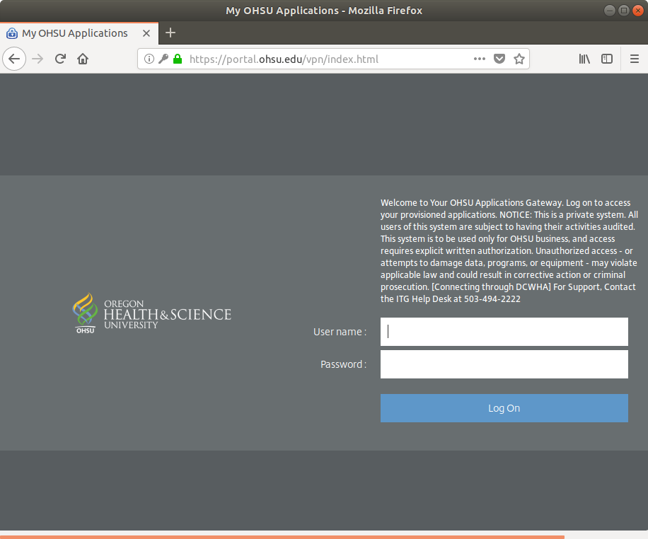
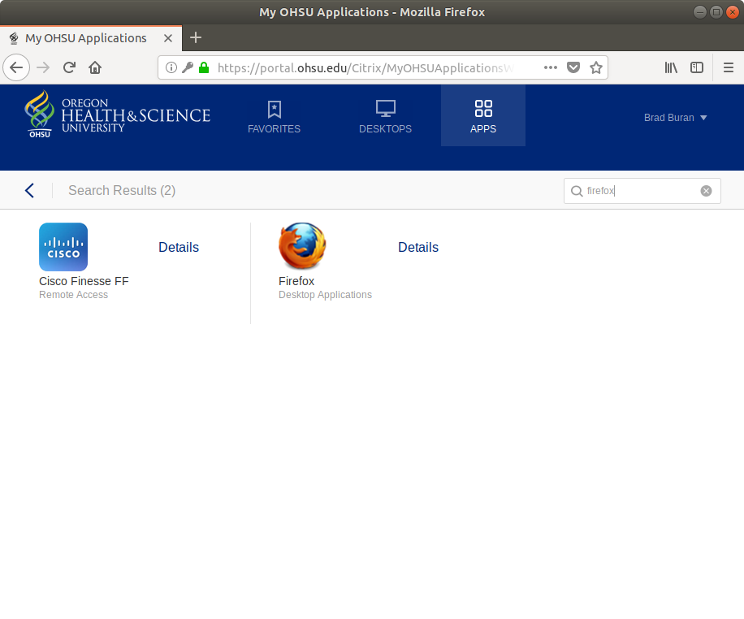

Citrix remote access instructions
---------------------------------

## Prerequisites
You do not automatically have remote access privileges via Citrix. If you don't have remote access privileges, please [request access to Citrix from IT](https://o2.ohsu.edu/information-technology-group/help-desk/it-help-pages/remote-windows-web.cfm). If you do not have an OHSU account, you will need to use your own Python install. The course staff has submitted requests for everyone to receive access to Citrix, so most of you should be able to skip this step. If you already know how to use another remote access technology (e.g., VPN), you may do so.

## Logging into Citrix
To login to Citrix, go to https://portal.ohsu.edu and login using your username and password.

Select the `APPS` icon from the list in the dark blue strip. A search bar will appear below it. Where it says `Search All Apps`, type `firefox`. Select the Firefox icon from the list.

Once you open Firefox, you should have a new browser that has access to OHSU's secure network. You *must* use this specific window to access exajupyter. Using this browser, navigate to https://exajupyter.ohsu.edu and [login using the instructions for exajupyter](exajupyter.md).
