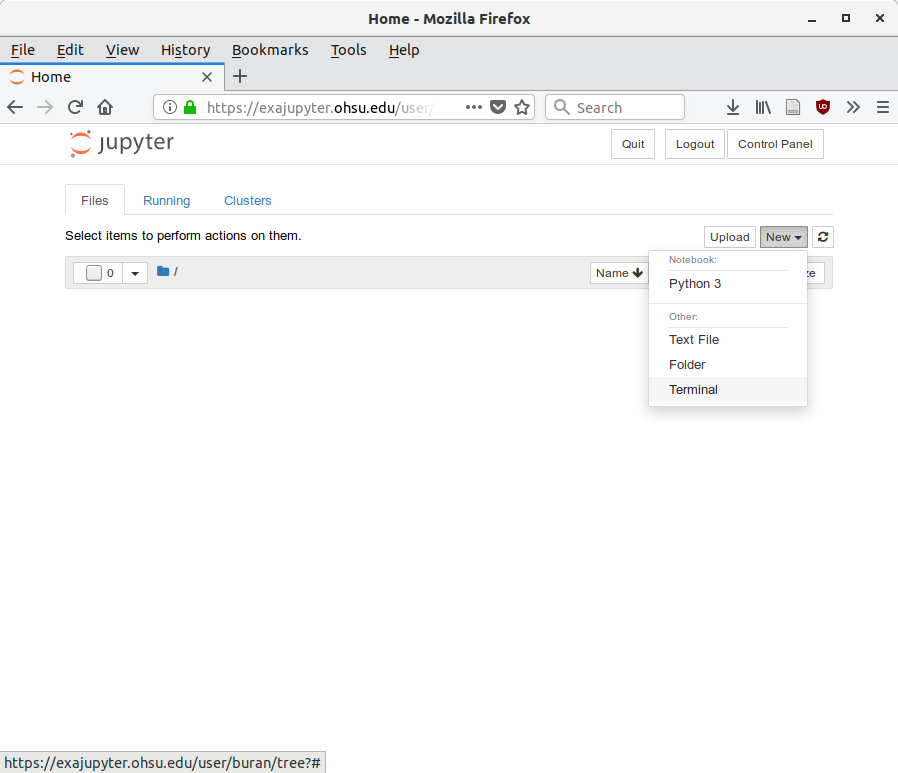

Exajupyter instructions
-----------------------
If you have an OHSU email, you should already have access to OHSU's [Jupyter notebook server](https://exajupyter.ohsu.edu). To get started on the server, first login to https://exajupyter.ohsu.edu using your OHSU account. 

After logging in, start the server.

On the next page, you will be asked what resources you need for the server. It's typically safe to use the defaults, but set the job duration to 24 hours to give you time to work on your project. If your server automatically gets shut down, you can simply restart it (notebooks auto-save themselves).

Now, you need to configure your notebook environment to access the NEUS634 resources. The default version of Python installed on the server does not contan many of the scientific packages we will be using in this course. For the class, we have installed a separate version of Python that contains the resources you'll need. To set up the environment for the class, open a terminal by selecting `New -> Terminal` from the drop-down menu.

Run the setup script by typing the following text in the terminal and hitting `enter`:

	source /home/exacloud/lustre1/NEUS642/bin/NEUS642_setup

If it's successful, you'll see the following messages (note that buran will be
replaced with your username):

	Installing NEUS642 kernel
	Installed kernelspec NEUS642 in /home/users/buran/.local/share/jupyter/kernels/neus642
	Editing /home/users/buran/.bash_profile to include /home/exacloud/lustre1/NEUS642/bin in the path

Now, copy the notebooks over to your home folder. We've created a shell script to support this. Run the script by typing the following text in the terminal and hitting `enter`:

	NEUS642_update_notebooks

The first time you run this script, you'll get a long list of messages starting and ending with the following lines (the `...` denotes the list of files that were transferred):

	sending incremental file list
	notebooks/
	...
	sent 391479274 bytes  received 2532 bytes  11686024.06 bytes/sec
	total size is 391421880  speedup is 1.00

After running this script, you now have a local copy of all the notebooks and data and can modify the notebooks as you see fit. Each week you will need to re-run this script before class to obtain a copy of the notebooks and data that will be used for that week. I will send an email once the notebooks are ready.

Now, close your console by closing the browser tab. Go back to the first tab (or go back to https://exajupyter.ohsu.edu if you already closed the tab). You may have to hit refresh in your browser to force the server to load the NEUS634 resources. If you're successful, you will see a new folder called NEUS634 and a new option, NEUS634, will be available via the `New` drop-down menu. Ignore the perl5 folder. It's automatically created each time you open a terminal.

You can now create notebooks. When creating a notebook, be sure to select `New -> NEUS642` to ensure that you use the proper Python environment (also known as a kernel). If you make a mistake and accidentally select `Python 3`, you can switch between the two kernels after opening the notebook.
